# Checkout Cart ProtoType
[](https://dotnet.microsoft.com/download/dotnet-framework/net472) [](https://www.visualstudio.com/thank-you-downloading-visual-studio/?sku=Community&rel=15) [](https://www.microsoft.com/en-us/sql-server/sql-server-editions-express)

# What is Checkout Cart
Checkout Cart is a Prototype for the basic operations needed for controlling a shopping cart.

Operations currently covered in this Prototype are: 
 1. Add a new Item to the cart.
 2. Edit existing cart item.
 3. Removing cart item.
 4. Clear Cart


# Business Overview & FAQ
In this section, we will explain how we see the shopping cart from our perspective and what is the business terminologies we use

## Business Terminologies:
### Shopping Cart Status:
Shopping Cart status define if this shopping cart has turned to be an order or not. If the status = **In Progress** this means that the user still able to add/remove/update or even clear the basket because it still not turned to an order.
### Cart Item
Shopping cart divided into one or more of **Cart Item(s)**, each **Cart Item** represent the quantity of specific product.
*Example*: If a customer select to buy **3 Adidas Sneaker** , this means that we have a Cart Item of this product with **Quantity = 3**

## Assumptions:
If **Shopping Cart** has no ** Cart Items** it will be deleted and the 

## Roadmap for this Prototype
1. Implement proper middle-ware exception handling.
2. Implement logging component to be able to track any warning or errors.

## FAQ
###  Shopping Cart ? What Does this means?
Shopping cart is the first initial step of creating an order. In simple words if you want to create an order you will first to have a shopping cart with some of products.

### What is the Shopping Cart Contains ? 
Shopping cart contains one or more of **Cart Items**  -  *refer to Business Terminology Section*

### What is the difference between Shopping Cart and Order
Actually, order is the second stage of shopping cart. In other words, an order is created from a shopping cart with status = **Finalized**

### When a shopping cart will be finalized ?
 When a user select to proceed with the shopping cart to payment, then the shopping cart is finalized and can't be edited because it will be processed by carriers and suppliers.
 


# Getting Started

These instructions will get you a copy of the project up and running on your local machine for development and testing purposes. 

## Installing:
1.  Make sure that all the required software are installed.
2.  restore nuget packages using visual studio or by executing below script in the solution root folder 
```dotnet restore```
3. Restore SQL `DB\*.bak` file into your local SQL database server. Click [here](https://stackoverflow.com/a/30338131) for more information.

## How to use:
To know How to use this prototype, refer to the client demo console application in the solution.


# Prototype High Level E2E 
This Section will demonstrate how the different cycles covered in this prototype

## 1.1 Add New Item E2E Cycle Flow-Chart



## 1.2 Add New Item E2E Cycle Details:

 1. New cart item API invoked `POST api/item/cart` with all required details about the item that will be inserted.
 2. The payload will be passed to **New Item** processor.
 3. The processor first will check whether the quantity needed is existed in stock for this product or not.
 4. If the stock has no availability, then an exception will be thrown with a well defined message.
 5. If the stock has availability, the processor will check if there is an existing cart with **In Progress** status. If there is one, then the new item will be added to this cart.
 6. If there is no existing cart for the user, a new cart will be created and then the new item will be added to the created cart.
 
## 2.1 Update Item E2E Cycle Flow-Chart


## 2.2 Update Item E2E Cycle Details:
1.  Update cart item API invoked `PUT api/item/cart` with all required details about the item that will be updated.
2. The payload will be passed to **Update Item** processor.
3. The processor will first check if the new quantity is more than than the previous quantity or not. if not **Skip to Step #6**
4. If the new quantity is more than previous quantity, this means that we should check if the difference quantity is available in stock
5. If the difference is not available an exception is thrown with well defined message.
6. The processor then will be update the product availability in stock and the new quantity for the item.

## 3.1 Delete Cart Item E2E Cycle Flow-Chart


## 3.2 Delete Cart Item E2E Cycle Details
1.  Delete cart item API invoked `DELETE api/item/cart` with all required details about the item that will be deleted.
2. The payload will be passed to **Delete Item** processor.
3. The processor will first update the product availability by adding the current item quantity to the existing quantity.
4. Then, the processor will check if the item that will be deleted is the only item in the shopping cart or not.
5. If yes, this means that we no longer in need for this shopping cart record as it will be empty. Hence, the entire shopping cart record will be deleted.
6. If no, only the cart item will be deleted.

## 4.1 Clear Cart E2E Cycle Flow-Chart


## 4.2 Clear Cart E2E Cycle Flow-Chart
1. Delete cart item API invoked `DELETE api/cart/{userId}` 
2. The userId will be passed to **Delete Item** processor.
3. The processor will then retreive the current shopping cart of the respective user that has Status = **In Progress**
4. The processor will update all cart products availability, then the entire shopping cart and the related cart items will be deleted.

# Database Tables
In this section, we will explain the meaning behind each table and which data should each of them persist

 1. `dbo.user` this table store basic information about the users that will use this proto-type
 2. `dbo.products` a simple table that store basic information about the product that we could provide and this comes along with their prices and quantity.
 3. `dbo.shoppingCart` base table for the shopping cart that stores when the shopping cart has been created and it has relationship with `dbo.user` and `dbo.ShoppingCartStatus`
 4. `dbo.ShoppingCartStatus` Lookup table that stores statuses for shopping cart.
 5. `dbo.CartItems` This table holds the items that the shopping cart will contains, it has relationships with `dbo.Products` and `dbo.ShoppingCart`

